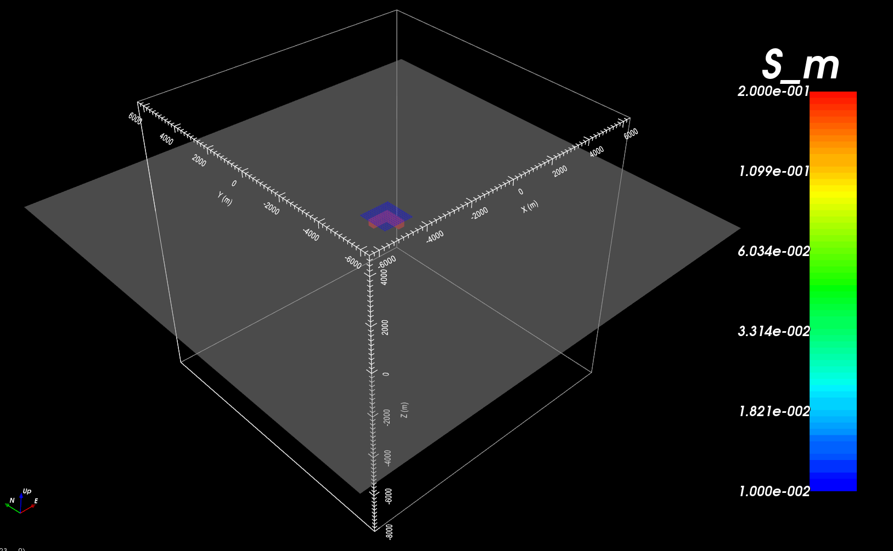

.. _example_model:

Create Model
============

Here, the code **blk3cellOct.exe** and the input file **blk3cellOct.inp** (:ref:`see format <e3d_blk3cell_input>`) are used to create a conductivity model on the OcTree mesh. For this example, we use the mesh that was created in the example ":ref:`create OcTree mesh<example_octree>`". Files relevant to this part of the example are in the sub-folder *octree_model*. Before running this example, you may want to do the following:

	- `Download and open the zip folder containing the entire E3D version 2 example <https://github.com/ubcgif/E3D/raw/e3dinv_ver2/assets/e3d_ver2_example.zip>`__ (if not done already)
	- Learn how to run :ref:`blk3cellOct<e3d_model_blk3cell>` from command line
	- Learn the format of the input files :ref:`blk3cellOct.inp<e3d_blk3cell_input>`

Here is the input file for **blk3cellOct.exe**

.. figure:: ../inputfiles/images/create_blk3cellOct_input.png
     :align: center
     :width: 700

The resulting Octree model (core region only) shows a conductive block (:math:`\sigma` = 1 S/m) within a highly resistive background (:math:`\sigma_b` = 0.00001 S/m).

     Cross-section at 0 m Northing (left). Cross-section at 0 m Easting (right).

