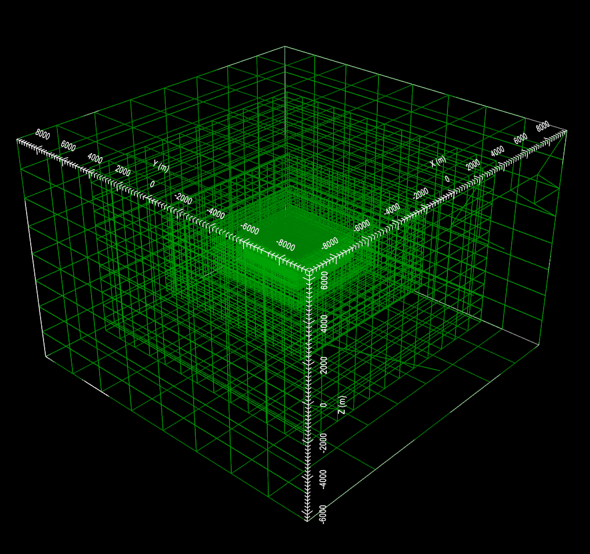

.. _example_octree:

Create OcTree Mesh
==================

Here, the code **create_octree_mesh_e3d_v2_tiled.exe** and the input file **octree_mesh.inp** (:ref:`see format <e3d_input_octree>`) are used to create an OcTree mesh based on the set of observation location and surface topography. Files relevant to this part of the example are in the sub-folder *octree_mesh*. Before running this example, you may want to do the following:

	- `Download and open the zip folder containing the entire E3DRH version 2 tiled example <https://github.com/ubcgif/E3DRH/raw/e3drh_v2_tiled/assets/e3drh_v2_tiled_example.zip>`__ (if not done already)
	- :ref:`Learn how to run code from command line <e3d_octree>`
	- :ref:`Learn the format of the input file <e3d_input_octree>`

To generate the OcTree mesh, the following input file was used:

.. figure:: ../inputfiles/images/create_octree_input.png
     :align: center
     :width: 700

To keep the problem simple, the topography is given a constant elevation of 0 m. The resulting OcTree mesh is shown below:

