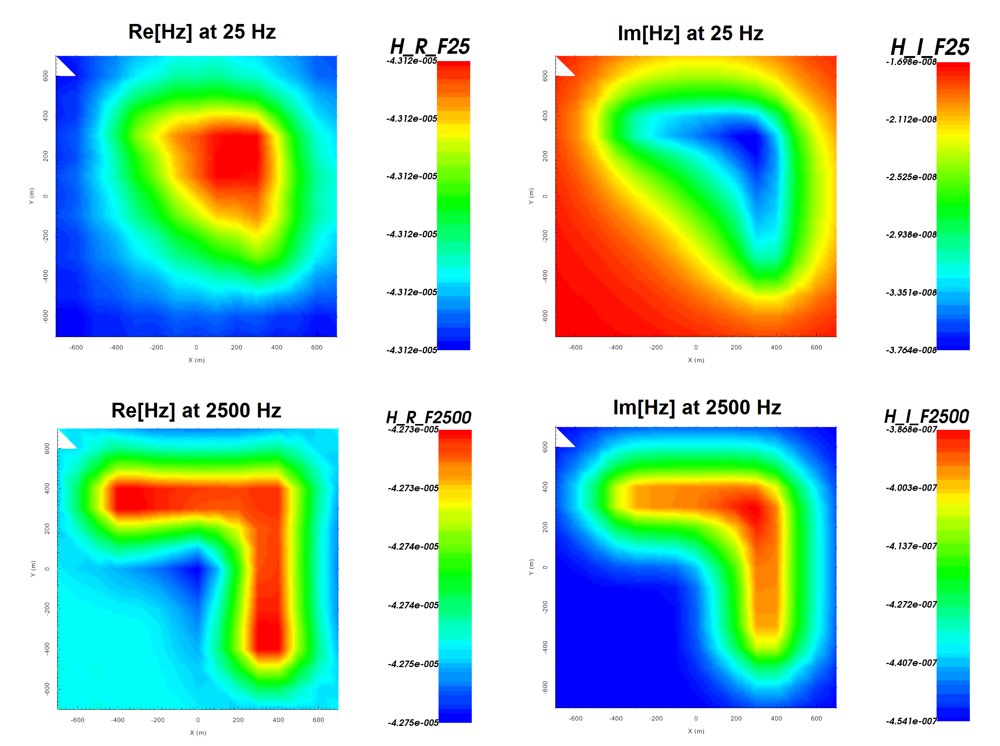

.. _example_fwd:

Forward Modeling
================

Here, the code **e3drh_v2_tiled.exe** and the input file **e3dfwd.inp** (:ref:`see format <e3d_input_fwd>`) are used to forward model secondary field FEM data for a synthetic model. The flag *SECONDARY_NUMERIC* was used to compute the primary field numerically. Files relevant to this part of the example are in the sub-folder *fwd*. For this example, we use the model that was created in the example ":ref:`create model<example_model>`". Before running this example, you may want to do the following:

	- `Download and open the zip folder containing the entire E3DRH version 2 tiled example <https://github.com/ubcgif/E3DRH/raw/e3drh_v2_tiled/assets/e3drh_v2_tiled_example.zip>`__ (if not done already)
	- :ref:`Learn how to run code from command line <e3d_fwd>`
	- :ref:`Learn the format of the input file <e3d_input_fwd>`

To forward model the data, the following input file was used:

.. figure:: ../inputfiles/images/create_fwd_input.png
     :align: center
     :width: 700

Predicted data are shown below.

