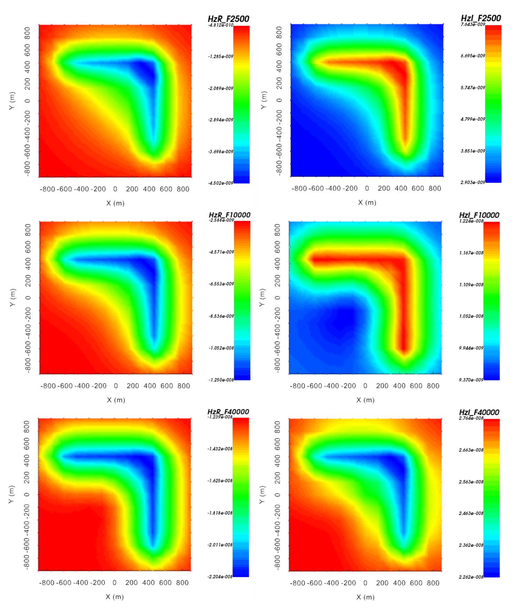

.. _example_fwd:

Forward Modeling
================

Here, the code **e3dinv_ver2.exe** and the input file **e3dfwd.inp** (:ref:`see format <e3d_input_fwd>`) are used to forward model FEM data for a synthetic model. Files relevant to this part of the example are in the sub-folder *fwd*. For this example, we use the model that was created in the example ":ref:`create model<example_model>`". Before running this example, you may want to do the following:

	- `Download and open the zip folder containing the entire E3D version 1 example <https://github.com/ubcgif/E3D/raw/master/assets/e3d_ver1_example.zip>`__ (if not done already)
	- :ref:`Learn how to run code from command line <e3d_fwd>`
	- :ref:`Learn the format of the input file <e3d_input_fwd>`

To forward model the data, the following input file was used:

.. figure:: ../inputfiles/images/create_fwd_input.png
     :align: center
     :width: 700

Predicted data are shown below.

     Real component of the vertical magnetic field at 10 kHz (left). Imaginary component of the vertical magnetic response at 10 kHz (right).

