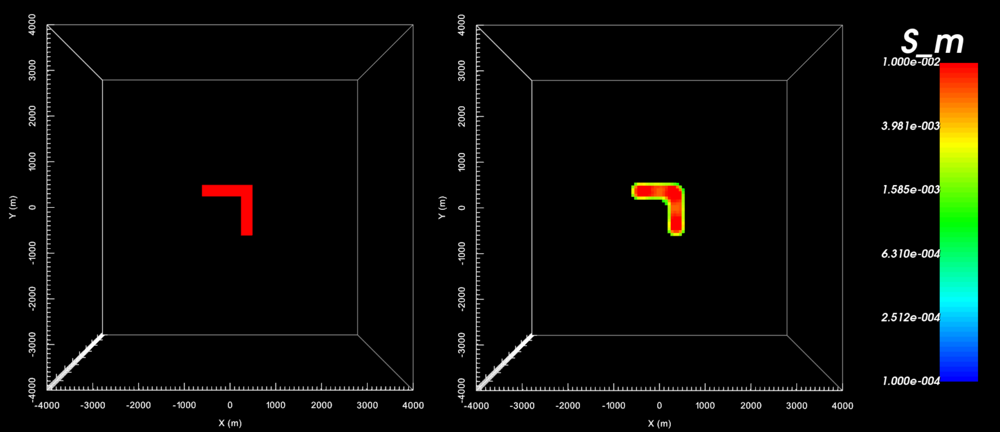

.. _example_inv:

Inversion
=========

Here, the code **e3drh_v2_tiled.exe** and the input file **e3dinv.inp** (:ref:`see format <e3d_input_inv>`) are used to invert Hz data. FEM data were created in the example ":ref:`forward modeling<example_fwd>`". Because we are doing a simple example, a floor uncertainty of 5e-10 A/m was added to all data. In practice, data are noisy and choosing appropriate uncertainties is very important for successful inversion. Files relevant to this part of the example are in the sub-folder *inv*. Before running this example, you may want to do the following:

	- `Download and open the zip folder containing the entire E3DRH version 2 tiled example <https://github.com/ubcgif/E3DRH/raw/e3drh_v2_tiled/assets/e3drh_v2_tiled_example.zip>`__ (if not done already)
	- :ref:`Learn how to run code from command line <e3d_inv>`
	- :ref:`Learn the format of the input file <e3d_input_inv>`

To invert the synthetic data, the input file below was used:

.. figure:: ../inputfiles/images/create_inv_input.png
     :align: center
     :width: 700

The true model (left) and recovered model at iteration 6 (right). A cutoff of 0.001 S/m was used. The recovered model was sliced horizontally at an elevation of -200 m.

