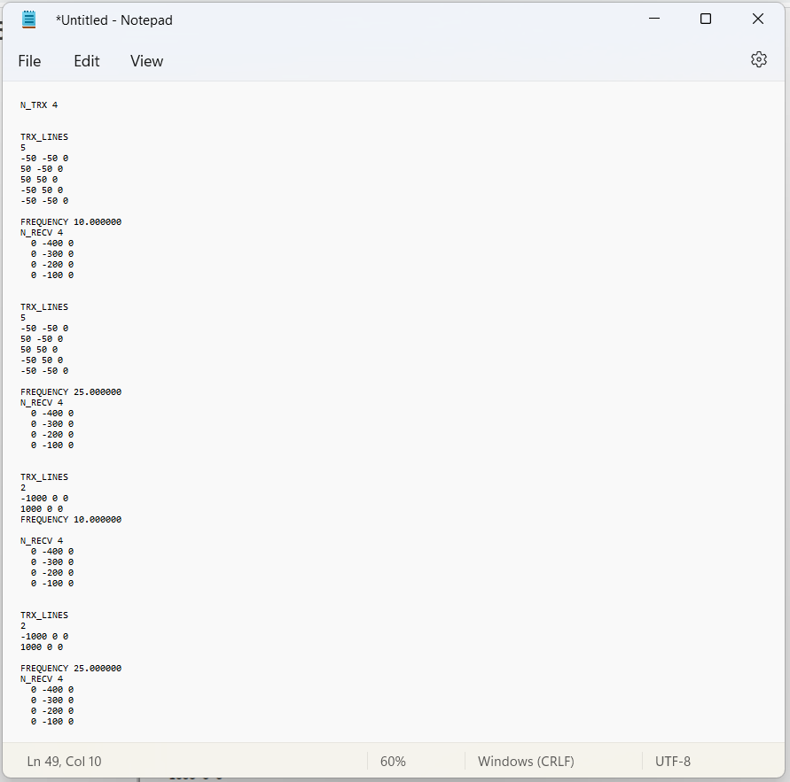

.. _surveyFile:

Survey and Locations File
=========================

.. important:: Only relevant to the E3DMT version 1 (2014 and 2015) code.

The survey and locations file is used to predict synthetic field data (forward modeling). This file contains all necessary survey information including: the number of transmitters, transmitter geometry, observation locations and frequencies. 

.. note:: Bolded entries are fixed flags recognized by the Fortran codes and blue hyperlinked entries are values/regular expressions specified by the user

The lines of the survey file are formatted as follows:

| **N_TRX** :math:`\;` :ref:`n_trx<e3dmt_survey_ln1>`
|
| :ref:`trx type<e3dmt_survey_ln2>`
| :ref:`n_nodes<e3dmt_survey_ln3>`
| :math:`\;\;` :ref:`x1 y1 z1<e3dmt_survey_ln4>`
| :math:`\;\;` :ref:`x2 y2 z2<e3dmt_survey_ln4>`
| :math:`\;\;\;\;\;\;\;\; \vdots`
| :math:`\;\;` :ref:`xn yn zn<e3dmt_survey_ln4>`
| :math:`\;\;` :ref:`x1 y1 z1<e3dmt_survey_ln4>`
| 
| **FREQUENCY** :math:`\;` :ref:`f1<e3dmt_survey_ln5>`
| **N_RECV** :math:`\;` :ref:`n_recv<e3dmt_survey_ln6>`
| :math:`\;\;` :ref:`Loc Array<e3dmt_survey_ln7>`
|
| **FREQUENCY** :math:`\;` :ref:`f2<e3dmt_survey_ln5>`
| **N_RECV** :math:`\;` :ref:`n_recv<e3dmt_survey_ln6>`
| :math:`\;\;` :ref:`Loc Array<e3dmt_survey_ln7>`
|
| :math:`\;\;\;\;\;\; \vdots`
|
| **FREQUENCY** :math:`\;` :ref:`fn<e3dmt_survey_ln5>`
| **N_RECV** :math:`\;` :ref:`n_recv<e3dmt_survey_ln6>`
| :math:`\;\;` :ref:`Loc Array<e3dmt_survey_ln7>`
|
| *Repeat for number of transmitters*
|
|

     Example locations file for MTZ data.

Parameter Descriptions
----------------------

.. _e3dmt_survey_ln1:

    - **n_trx:** The total number of transmitters. Example: *N_TRX 3*

.. _e3dmt_survey_ln2:

    - **trx type:** Flag denoting the type of transmitter being used. Choices are one of the following:

        *TRX_ORIG:* a closed inductive loop source where the values in the x, y or z column must all be the same.
        *TRX_LINES:* a closed inductive loop source made of discrete line segments
        *TRX_LOOP:* a circular loop source.
         

.. _e3dmt_survey_ln3:

    - **n_nodes:** The number of nodes defining a particular transmitter loop. Note that:

        - You **must close the loop**
        - **Something here about CW or CCW**

.. _e3dmt_survey_ln4:

    - **xi yi zi:** This refers to the x, y and z locations of the nodes defining the transmitter loop.

.. _e3dmt_survey_ln5:

    - **fi:** The frequency (in Hz) at which the subsequent set of measurements are made.

.. _e3dmt_survey_ln6:

    - **n_recv:** The number of receivers collecting field observations at a particular frequency for a particular transmitter.

.. _e3dmt_survey_ln7:

    - **Loc Array:** Contains the x, y and z locations for measurements at a particular frequency for a particular transmitter. It has dimensions :ref:`n_recv<e3dmt_survey_ln6>` :math:`\times` 3.

.. important::

    - **Something about coordinate systems**

