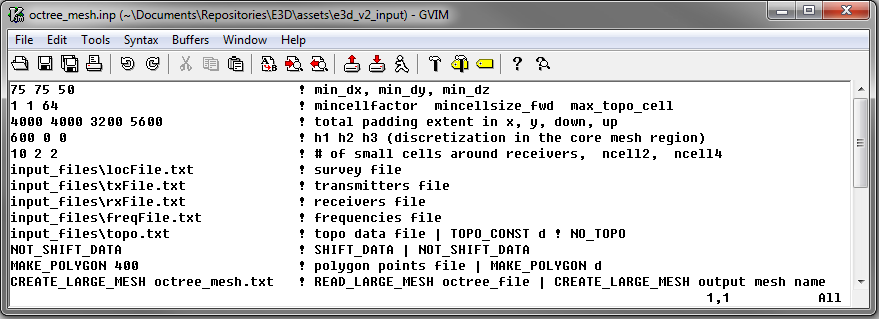

.. _e3d_input_octree:

Create OcTree Mesh Input File
=============================

:ref:`OcTree meshes<octreeFile>` used in the e3d code are created using the program **create_mesh_newformat_e3d.exe**. The lines within the input file are as follows:

.. tabularcolumns:: |C|C|C|

+--------+--------------------------------------------------------------------------+-------------------------------------------------------------------+
| Line # | Parameter                                                                | Descriptions                                                      |
+========+==========================================================================+===================================================================+
| 1      |:ref:`dx dy dz<e3d_input_octreeln1>`                                      | min. cell widths in x, y and z for base mesh                      |
+--------+--------------------------------------------------------------------------+-------------------------------------------------------------------+
| 2      |:ref:`min_cell_fact min_cell_size_fwd max_topo_cell<e3d_input_octreeln2>` | additional cell size parameters                                   |
+--------+--------------------------------------------------------------------------+-------------------------------------------------------------------+
| 3      |:ref:`x_pad y_pad down_pad up_pad<e3d_input_octreeln3>`                   | sets the extent of mesh in x, y and z direction                   |
+--------+--------------------------------------------------------------------------+-------------------------------------------------------------------+
| 4      |:ref:`dist_inv_1 dist_inv_2 dist_inv_3<e3d_input_octreeln4>`              | sets core mesh discretization for the inverse mesh                |
+--------+--------------------------------------------------------------------------+-------------------------------------------------------------------+
| 5      |:ref:`n1 n2 n3<e3d_input_octreeln5>`                                      | sets thickness of cells of finest discretization near receivers   |
+--------+--------------------------------------------------------------------------+-------------------------------------------------------------------+
| 6      |:ref:`locFile<e3d_input_octreeln6>`                                       | the file containing observation locations                         |
+--------+--------------------------------------------------------------------------+-------------------------------------------------------------------+
| 7      |:ref:`txFile<e3d_input_octreeln7>`                                        | the file defining all transmitters                                |
+--------+--------------------------------------------------------------------------+-------------------------------------------------------------------+
| 8      |:ref:`rxFile<e3d_input_octreeln8>`                                        | the file defining all receivers                                   |
+--------+--------------------------------------------------------------------------+-------------------------------------------------------------------+
| 9      |:ref:`freqFile<e3d_input_octreeln9>`                                      | the file containing the frequencies being measured                |
+--------+--------------------------------------------------------------------------+-------------------------------------------------------------------+
| 10     |:ref:`topoFile<e3d_input_octreeln10>`                                     | sets topography                                                   |
+--------+--------------------------------------------------------------------------+-------------------------------------------------------------------+
| 11     |:ref:`shift data<e3d_input_octreeln11>`                                   | shift data above topography                                       |
+--------+--------------------------------------------------------------------------+-------------------------------------------------------------------+
| 12     |:ref:`polygon edge width<e3d_input_octreeln12>`                           | sets horizontal extent of core region for the inversion mesh      |
+--------+--------------------------------------------------------------------------+-------------------------------------------------------------------+
| 13     |:ref:`read/create mesh<e3d_input_octreeln13>`                             | read in or create global inversion mesh                           |
+--------+--------------------------------------------------------------------------+-------------------------------------------------------------------+

**MUST BE REDONE**

     Example input file for creating octree mesh (`Download <https://github.com/ubcgif/E3D/raw/e3dinv_ver2/assets/input_files2/octree_mesh.inp>`__ )

Line Descriptions
^^^^^^^^^^^^^^^^^

.. _e3d_input_octreeln1:

    - **dx dy dz:** Minimum cell widths in x, y and z for the base mesh.

.. _e3d_input_octreeln2:

    - **min_cell_fact min_cell_size_fwd max_topo_cell:** These parameters determine the rate of cell expansion for regions near topography and for the local forward meshes.

        - **min_cell_fact:** Defines the rate of topography-based cell size increase on the global inversion mesh with respect to depth. After each layer of *N* cells, the cell size will increase by a factor of 2 until a maximum cell size (*max_topo_cell*) is reached. *N* must be an integer value that is a power of 2.
        - **min_cell_size_fwd:** This sets the minimum cell size for the local forward meshes. A value of 2 means the minimum cell size in the local mesh has a side width of 2 times the base mesh cell size. This parameter must be an integer value that is a power of 2.
        - **max_topo_cell:** This determines the maximum cell size for which topography-based cell size increase is used on the global inversion mesh; after which typical OcTree cell expansion is used. This parameter must be an integer value that is a power of 2.

.. _e3d_input_octreeln3:

    - **x_pad y_pad down_pad up_pad:** Distance from the core mesh region in the x, y, downward and upward directions, respectively, that the global inversion mesh extends.

.. _e3d_input_octreeln4:

    - **dist_inv_1 dist_inv_2 dist_inv_3:** For the global inversion mesh, these parameters set the discretization of the core mesh region (i.e. the region near the transmitters and receivers) in terms of depth. Up to a depth of *dist_inv_1* from the surface, the smallest cell size is used (set by *dx, dy, dz*). For the following *dist_inv_2* metres, a cell width 2 times large is used. For the following *dist_inv_3* metres, the cell width is doubled again. Below the third depth region, the cells widths increase by a factor of 2 for every additional layer (see the figure below).

.. _e3d_input_octreeln5:

    - **n1 n2 n3:** This sets the thicknesses of layers of finest discretization near the receivers. **n1 = 4** means that around each receiver, there is a layer 4 cells thick that uses the finest discretization. This is followed by a layer which is **n2** cells thick, where the cell dimensions are increased by a factor of 2. Likewise for the 3rd layer.

.. _e3d_input_octreeln6:

    - **locFile:** Path to the file containing the survey information. This can be either an :ref:`observed data<obsFile>` file, or a :ref:`survey index<indexFile>` file. 

.. _e3d_input_octreeln7:

    - **txFile:** Path to the file defining the transmitters; i.e. the :ref:`transmitter file<receiverFile>`.

.. _e3d_input_octreeln8:

    - **rxFile:** Path to the file defining the receivers; i.e. the :ref:`receiver file<receiverFile>`. 

.. _e3d_input_octreeln9:

    - **freqFile:** Path to the file defining the frequencies used in the survey; i.e. the :ref:`frequencies file<freqFile>`. 

.. _e3d_input_octreeln10:

    - **topoFile:** If a topography file is available, the file path to the topography file is entered; see :ref:`topography file<topoFile>` for format. In the case of flat topography, the user instead enter "TOPO_CONST", followed by a space, then the elevation of the surface topography; for example "TOPO_CONST 125.5".

.. _e3d_input_octreeln11:

    - **shift data:** If the flag "NOT_SHIFT_DATA" is used, then transmitters and receivers can lie below the surface topography. If "SHIFT_DATA" *filename* is entered, then new transmitter and receiver files are created such that the transmitters and receivers lie above the surface topography. *NOTE:* this line may be a legacy from E3D version 1 and may not be used.

.. _e3d_input_octreeln12:

    - **polygon edge width:** Here we define the horizontal extent of the core inversion mesh region. The user may do this by providing the path to a file containing the points for a polygon. The user may also set the horizontal extent of the core mesh region based on transmitter and receiver locations. The set of transmitter and receiver locations can be used to create a convex hull. For this option the user types "*MAKE_POLYGON d*", where *d* is the distance outside the convex hull the user want to extend to core mesh region.

.. _e3d_input_octreeln13:

    - **read/create mesh:** If the global inversion mesh has already been created, then it may be loaded by typing "READ_LARGE_MESH *filepath*". In this case, the global inversion mesh is used to define the local forward meshes. If the global inversion mesh needs to be created, the user types "CREATE_LARGE_MESH *filename*", where the global inversion mesh is output to the file *filename*.

.. note:: This functionality is relevant to the *e3dinv_ver2_tiled* code. For *e3dinv_ver2*, use "CREATE_LARGE_MESH *filename*"

