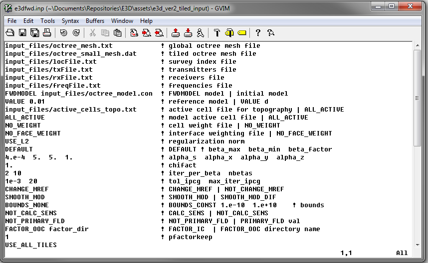

.. _e3dmt_input_fwd:

Forward Modeling Input File
===========================

The forward problem is solved using the executable program **e3dfwd_pardiso.exe**. Parameters necessary for running the forward modeling code are set in the input file. The lines of input file are as follows:

.. tabularcolumns:: |L|C|C|

+--------+------------------------------------------------------+-----------------------------------------------+
| Line # | Parameter                                            | Description                                   |
+========+======================================================+===============================================+
|   1    |:ref:`OcTree Mesh<e3dmt_input_fwd_ln1>`               | path to octree mesh file                      |
+--------+------------------------------------------------------+-----------------------------------------------+
|   2    |:ref:`Receiver Locations<e3dmt_input_fwd_ln2>`        | path to observation locations file            |
+--------+------------------------------------------------------+-----------------------------------------------+
|   3    |:ref:`Real Conductivity<e3dmt_input_fwd_ln3>`         | path to conductivity model                    |
+--------+------------------------------------------------------+-----------------------------------------------+
|   4    |:ref:`Imaginary Conductivity<e3dmt_input_fwd_ln4>`    | path to imaginary conductivity file (optional)|
+--------+------------------------------------------------------+-----------------------------------------------+
|   5    |:ref:`Topography<e3dmt_input_fwd_ln5>`                | set topography                                |
+--------+------------------------------------------------------+-----------------------------------------------+
|   6    |:ref:`Primary field options<e3dmt_input_fwd_ln6>`     | primary field computation options             |
+--------+------------------------------------------------------+-----------------------------------------------+
|   7    |:ref:`Memory options<e3dmt_input_fwd_ln7>`            | memory options for factorizations             |
+--------+------------------------------------------------------+-----------------------------------------------+

     Example input file for forward modeling program (`Download <https://github.com/ubcgif/e3dmt/raw/master/assets/input_files1/e3dMT_octree_fwd.inp>`__ ).

Line Descriptions
^^^^^^^^^^^^^^^^^

.. _e3dmt_input_fwd_ln1:

    - **OcTree Mesh:** file path to the OcTree mesh file

.. _e3dmt_input_fwd_ln2:

    - **Receiver Locations:** file path to the :ref:`survey file<surveyFile>`.

.. _e3dmt_input_fwd_ln3:

    - **Real Conductivity:** file path to the conductivity model. If complex conductivities are being used, this model represents real-valued conductivities.

.. _e3dmt_input_fwd_ln4:

    - **Imaginary Conductivity:** If the conductivity model used in the forward simulation is strictly real-valued, the user may enter "NO_IMAG_COND" on this line. Otherwise, the user enters the file path to the imaginary conductivity model.

.. _e3dmt_input_fwd_ln5:

    - **Topography:** The user may supply the file path to an active cells model file or type "ALL_ACTIVE". The active cells model has values 1 for cells lying below the surface topography and values 0 for cells lying above.

.. _e3dmt_input_fwd_ln6:

    - **Primary Field Options:**

.. _e3dmt_input_fwd_ln7:

    - **Memory options:** This code uses a factorization to solve the forward system at each frequency. These factorizations must be stored. By using the flag ‘FACTOR_IC’ (in cpu), factorizations are stored within a computer’s RAM. Although this is faster, larger problems cannot be solved if insufficient temporary memory is available. The factorizations are stored in permanent memory (disk) if the flag ‘FACTOR_OOC’ (out of cpu) is used followed by the path to a directory. This is slower because the program must read these files many times. The second options is ill-advised if files are being transferred over a network.

.. Version 2 (2017)
.. ----------------

.. Both the forward problem and inverse problem are solved using the executable program **e3dMTinv_ver2.exe**. As a result, the :ref:`input file<e3dmt_input_inv2>` will be described within the :ref:`running the inversion<e3dmt_inv2>` section.

