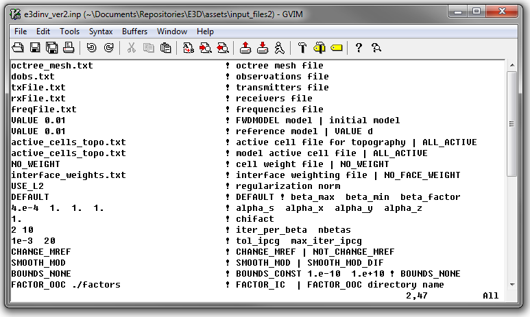

.. _e3dmt_input_inv:

Inversion Input File
====================

The inverse problem is solved using the executable program **e3dinv_pardiso.exe**. The lines of input file are as follows:

.. tabularcolumns:: |L|C|C|

+--------+--------------------------------------------------------------------+-------------------------------------------------------------------+
| Line # | Description                                                        | Description                                                       |
+========+====================================================================+===================================================================+
| 1      | :ref:`OcTree Mesh<e3dmt_input_inv_ln1>`                            | path to octree mesh file                                          |
+--------+--------------------------------------------------------------------+-------------------------------------------------------------------+
| 2      | :ref:`Observation File<e3dmt_input_inv_ln2>`                       | path to observations file                                         |
+--------+--------------------------------------------------------------------+-------------------------------------------------------------------+
| 3      | :ref:`Initial Model<e3dmt_input_inv_ln3>`                          | initial model                                                     |
+--------+--------------------------------------------------------------------+-------------------------------------------------------------------+
| 4      | :ref:`Reference Model<e3dmt_input_inv_ln4>`                        | reference model                                                   |
+--------+--------------------------------------------------------------------+-------------------------------------------------------------------+
| 5      | :ref:`Active Topography Cells<e3dmt_input_inv_ln5>`                | topography                                                        |
+--------+--------------------------------------------------------------------+-------------------------------------------------------------------+
| 6      | :ref:`Active Model Cells<e3dmt_input_inv_ln6>`                     | active model cells                                                |
+--------+--------------------------------------------------------------------+-------------------------------------------------------------------+
| 7      | :ref:`Cell Weights<e3dmt_input_inv_ln7>`                           | additional cell weights                                           |
+--------+--------------------------------------------------------------------+-------------------------------------------------------------------+
| 8      | :ref:`Face Weights<e3dmt_input_inv_ln8>`                           | additional face weights                                           |
+--------+--------------------------------------------------------------------+-------------------------------------------------------------------+
| 9      | :ref:`beta_max beta_min beta_factor<e3dmt_input_inv_ln9>`          | cooling schedule for beta parameter                               |
+--------+--------------------------------------------------------------------+-------------------------------------------------------------------+
| 10     | :ref:`alpha_s alpha_x alpha_y alpha_z<e3dmt_input_inv_ln10>`       | weighting constants for smallness and smoothness constraints      |
+--------+--------------------------------------------------------------------+-------------------------------------------------------------------+
| 11     | :ref:`Chi Factor<e3dmt_input_inv_ln11>`                            | stopping criteria for inversion                                   |
+--------+--------------------------------------------------------------------+-------------------------------------------------------------------+
| 12     | :ref:`tol_nl mindm iter_per_beta<e3dmt_input_inv_ln12>`            | set the number of Gauss-Newton iteration for each beta value      |
+--------+--------------------------------------------------------------------+-------------------------------------------------------------------+
| 13     | :ref:`tol_ipcg max_iter_ipcg<e3dmt_input_inv_ln13>`                | set the tolerance and number of iterations for Gauss-Newton solve |
+--------+--------------------------------------------------------------------+-------------------------------------------------------------------+
| 14     | :ref:`Reference Model Update<e3dmt_input_inv_ln14>`                | reference model                                                   |
+--------+--------------------------------------------------------------------+-------------------------------------------------------------------+
| 15     | :ref:`Hard Constraints<e3dmt_input_inv_ln15>`                      | use *SMOOTH_MOD* or *SMOOTH_MOD_DIFF*                             |
+--------+--------------------------------------------------------------------+-------------------------------------------------------------------+
| 16     | :ref:`Bounds<e3dmt_input_inv_ln16>`                                | upper and lower bounds for recovered model                        |
+--------+--------------------------------------------------------------------+-------------------------------------------------------------------+
| 17     | :ref:`Primary field options<e3dmt_input_inv_ln17>`                 | primary field computation options                                 |
+--------+--------------------------------------------------------------------+-------------------------------------------------------------------+
| 18     | :ref:`Memory options<e3dmt_input_inv_ln18>`                        | memory options for factorizations                                 |
+--------+--------------------------------------------------------------------+-------------------------------------------------------------------+

     Example input file for the inversion program (`Download <https://github.com/ubcgif/e3dmt/raw/master/assets/input_files1/e3dMT_octree_inv.inp>`__ ).

Line Descriptions
^^^^^^^^^^^^^^^^^

.. _e3dmt_input_inv_ln1:

    - **OcTree Mesh:** file path to the OcTree mesh file

.. _e3dmt_input_inv_ln2:

    - **Observation File:** file path to the :ref:`observed data file<obsFile>`

.. _e3dmt_input_inv_ln3:

    - **Initial Model:** The user may supply the file path to an initial conductivity model. If a homogeneous conductivity value is being used for all active cells, the user can enter "VALUE" followed by a space and a numerical value; example "VALUE 0.01".

.. _e3dmt_input_inv_ln4:

    - **Reference Model:** The user may supply the file path to a reference conductivity model. If a homogeneous conductivity value is being used for all active cells, the user can enter "VALUE" followed by a space and a numerical value; example "VALUE 0.01".

.. _e3dmt_input_inv_ln5:

    - **Active Topography Cells:** Here, the user can choose to specify the cells which lie below the surface topography. To do this, the user may supply the file path to an active cells model file or type "ALL_ACTIVE". The active cells model has values 1 for cells lying below the surface topography and values 0 for cells lying above.

.. _e3dmt_input_inv_ln6:

    - **Active Model Cells:** Here, the user can choose to specify the model cells which are active during the inversion. To do this, the user may supply the file path to an active cells model file or type "ALL_ACTIVE". The active cells model has values 1 for cells lying below the surface topography and values 0 for cells lying above. Values for inactive cells are provided by the background conductivity model.

.. _e3dmt_input_inv_ln7:

    - **Cell Weights:** Here, the user specifies whether cell weights are supplied. If so, the user provides the file path to a :ref:`cell weights file <weightsFile>`  If no additional cell weights are supplied, the user enters "NO_WEIGHT".

.. _e3dmt_input_inv_ln8:

    - **Face Weights:** Here, the user specifies whether face weights are supplied. If so, the user provides the file path to a face weights file :ref:`cell weights file <weightsFile>`. If no additional cell weights are supplied, the user enters "NO_FACE_WEIGHT". The user may also enter "EKBLOM" for 1-norm approximation to recover sharper edges.

.. _e3dmt_input_inv_ln9:

    - **beta_max beta_min beta_factor:** Here, the user specifies protocols for the trade-off parameter (beta). *beta_max* is the initial value of beta, *beta_min* is the minimum allowable beta the program can use before quitting and *beta_factor* defines the factor by which beta is decreased at each iteration; example "1E4 10 0.2". The user may also enter "DEFAULT" if they wish to have beta calculated automatically.

.. _e3dmt_input_inv_ln10:

    - **alpha_s alpha_x alpha_y alpha_z:** `Alpha parameters <http://giftoolscookbook.readthedocs.io/en/latest/content/fundamentals/Alphas.html>`__ . Here, the user specifies the relative weighting between the smallness and smoothness component penalties on the recovered models.

.. _e3dmt_input_inv_ln11:

    - **Chi Factor:** The chi factor defines the target misfit for the inversion. A chi factor of 1 means the target misfit is equal to the total number of data observations.

.. _e3dmt_input_inv_ln12:

    - **tol_nl mindm iter_per_beta:** Here, the user specifies the number of Newton iterations. *tol_nl* is the Newton iteration tolerance (how close the gradient is to zero), *mindm* is the minimum model perturbation :math:`\delta m` allowed and iter_per_beta is the number of iterations per beta value.

.. _e3dmt_input_inv_ln13:

    - **tol_ipcg max_iter_ipcg:** Here, the user specifies solver parameters. *tol_ipcg* defines how well the iterative solver does when solving for :math:`\delta m` and *max_iter_ipcg* is the maximum iterations of incomplete-preconditioned-conjugate gradient.

.. _e3dmt_input_inv_ln14:

    - **Reference Model Update:** Here, the user specifies whether the reference model is updated at each inversion step result. If so, enter "CHANGE_MREF". If not, enter "NOT_CHANGE_MREF".

.. _e3dmt_input_inv_ln15:

    - **Hard Constraints:** SMOOTH_MOD runs the inversion without implementing a reference model (essential :math:`m_{ref}=0`). "SMOOTH_MOD_DIF" constrains the inversion in the smallness and smoothness terms using a reference model.

.. _e3dmt_input_inv_ln16:

    - **Bounds:** Bound constraints on the recovered model. Choose "BOUNDS_CONST" and enter the values of the minimum and maximum model conductivity; example "BOUNDS_CONST 1E-6 0.1". Enter "BOUNDS_NONE" if the inversion is unbounded, or if there is no a-prior information about the subsurface model.

.. _e3dmt_input_inv_ln17:

    - **Primary Field Options:**

.. _e3dmt_input_inv_ln18:

    - **Memory options:** This code uses a factorization to solve the forward system at each frequency. These factorizations must be stored. By using the flag ‘FACTOR_IC’ (in cpu), factorizations are stored within a computer’s RAM. Although this is faster, larger problems cannot be solved if insufficient temporary memory is available. The factorizations are stored in permanent memory (disk) if the flag ‘FACTOR_OOC’ (out of cpu) is used followed by the path to a directory. This is slower because the program must read these files many times. The second options is ill-advised if files are being transferred over a network.

