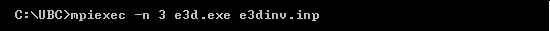

.. _e3d_inv:

Inversion Program
=================

Both the forward and inverse problems are solved using the **e3dinv.exe** executable program. In each case, format of the :ref:`input file<e3d_input_inv>` (denoted here as **e3dinv.inp**) is the same. In the case of forward modeling however, some lines in the input file are omitted.

Running the Program
^^^^^^^^^^^^^^^^^^^

To run the inversion, open a command line window and type the following:

The *mpiexec* call is used for parallelization. This is followed by the flag *-n*, then the number of frequencies (*"nFreq"*). This is followed by the inversion executable and the corresponding input file.

Units
^^^^^

    - **Electric field data:** Real and imaginary components of *Ex*, *Ey* and *Ez* in units V/m
    - **Magnetic field data:** Real and imaginary components of the total magnetic field *Hx*, *Hy* and *Hz* in units A/m. 
    - **Conductivity model:** S/m
    - **Reference/starting conductivity model:** S/m 
    - **Model/interface weights:** unitless

.. important:: Any combination of data, electric and or magnetic field components, can be be inverted. A specified flag at the start of the observations file can be used to omit columns or individual datums.

Output Files
^^^^^^^^^^^^

The program **e3dinv.exe** creates the following output files:

    - **dpred_fwd.txt** predicted data if forward modeling is used

    - **model0.con:** the starting model

    - **dpred0.txt** data predicted using the starting model

    - **inv_xx.con:** recovered model at iteration 'xx'

    - **dpred_xx.txt** data predicted using model 'xx'

    - **inv.con:** final conductivity model

    - **e3d_octree_inv_pardiso.log:** log file for the inversion

    - **e3d_octree_inv.pardiso.out:** stores details regarding the inversion

